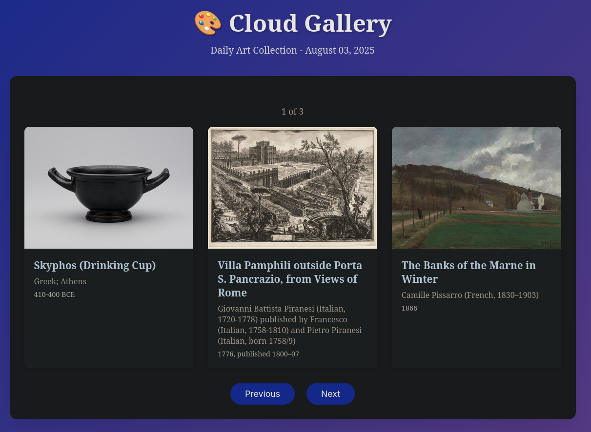
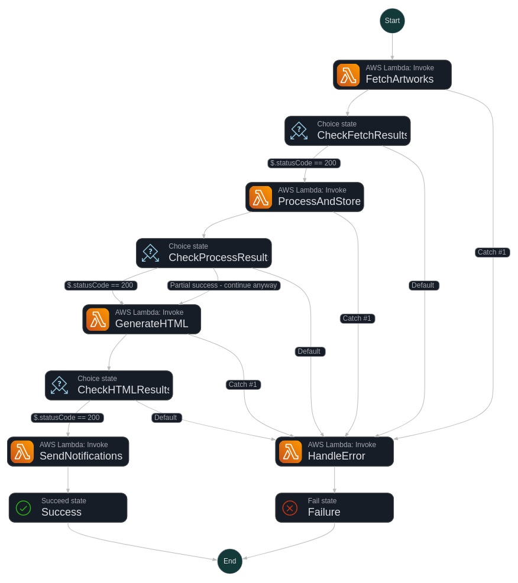

# ☁️🖼️ Cloud Gallery - Daily Dose of Art
[](https://www.python.org/)
[](https://aws.amazon.com/)
[](https://www.terraform.io/)
[](https://docs.github.com/en/actions)


A serverless data pipeline that fetches artwork from the Art Institute of Chicago API daily and displays them on a static website hosted on AWS S3.

## 📺 Live Website

**[View the Gallery →](http://cloud-gallery-dev-website-static.s3-website-us-east-1.amazonaws.com/)**

*Daily dose of curated artwork from the Art Institute of Chicago*

## 🏗️ Architecture



The pipeline uses the following AWS services in a serverless architecture:

- **EventBridge**: Daily scheduling (cron-based triggers)
- **Step Functions**: Workflow orchestration
- **Lambda Functions**: Data processing and API interactions
- **DynamoDB**: Metadata storage
- **S3**: Static website hosting

### Data Flow

```
EventBridge (Daily Schedule) 
    ↓
Step Functions (Workflow Orchestration) 
    ↓ 
    ├── Lambda 1: Fetch from Art Institute API 
    ├── Lambda 2: Process & Store in DynamoDB 
    ├── Lambda 3: Generate HTML & Upload to S3 
    └── Lambda 4: Send Notifications & Complete
```

## 📁 Project Structure

```
art-pipeline/
├── .github/workflows/     # GitHub Actions CI/CD
├── terraform/             # Infrastructure as Code
├── src/                   # Lambda function source code
│   ├── fetch_artwork/     # Lambda 1: API fetching
│   ├── process_data/      # Lambda 2: Data processing
│   ├── generate_site/     # Lambda 3: HTML generation
│   └── notifications/     # Lambda 4: Logging & notifications
├── tests/                 # Unit and integration tests
├── docs/                  # Documentation and diagrams
└── README.md
```

## 🚀 Prerequisites

- AWS CLI configured with appropriate permissions
- Terraform >= 1.0
- Python 3.9+
- GitHub account with Actions enabled

## ⚡ Quick Start

1. **Clone the repository**
   ```bash
   git clone https://github.com/your-username/cloud-gallery.git
   cd cloud-gallery
   ```

2. **Configure Terraform variables**
   ```bash
   cp terraform/terraform.tfvars.example terraform/terraform.tfvars
   # Update variables in terraform.tfvars with your AWS settings
   ```

3. **Deploy infrastructure**
   ```bash
   cd terraform
   terraform init
   terraform plan
   terraform apply
   ```

## 🚀 Deployment

### Automated Deployment (CI/CD)
The project includes GitHub Actions workflows for automated deployment:

- **Push to `main` branch**: Triggers full deployment pipeline
- **Pull Request**: Runs tests and validation
- **Daily**: Monitors pipeline health

The CI/CD pipeline includes:
- Infrastructure validation with Terraform
- Lambda function testing
- Automated deployment to AWS
- Post-deployment testing

Push to the main branch to trigger automatic deployment via GitHub Actions.

## 💰 Free Tier Compliance

This project is designed to stay within AWS Free Tier limits:

- **Lambda**: 1M requests/month, 400,000 GB-seconds
- **DynamoDB**: 25GB storage, 25 RCU/WCU  
- **S3**: 5GB storage, 20,000 GET requests
- **EventBridge**: 14M events/month (way more than 1 daily)
- **Step Functions**: 4,000 state transitions/month

*Daily execution should consume minimal resources well within these limits.*


## 📄 License

MIT License - see LICENSE file for details

---

*Built with ❤️ using AWS serverless technologies*